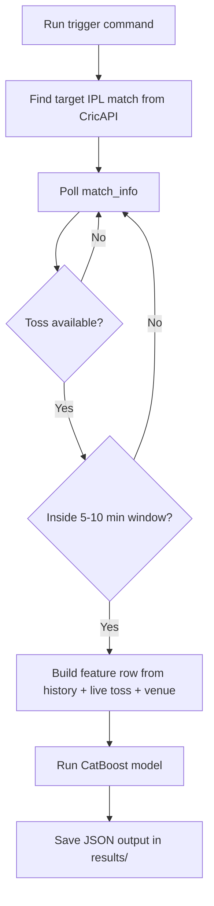

# IPL 2026 Automation Design

This file documents the implemented trigger-based automation in `production_model`.

## 1. What Is Implemented

The live automation is implemented with:

1. `scripts/auto_predict_trigger.py`
2. `scripts/run_today.sh`
3. `scripts/test_cricapi_key.py`
4. `scripts/manual_fallback_predict.py`
5. `scripts/record_match_result.py`
6. `scripts/model_health_check.py`
7. `scripts/ops_db.py`
8. `scripts/db_report.py`

Flow:



## 2. One-Time Setup

Run from `production_model` root:

```bash
pip install -r requirements.txt
```

Set API key:

```bash
export CRICAPI_KEY="YOUR_API_KEY"
```

Validate API connectivity:

```bash
python scripts/test_cricapi_key.py
```

## 3. Trigger Run Commands

### Option A: Simple One-Command Trigger

```bash
./scripts/run_today.sh --team1 RCB --team2 SRH
```

### Option B: Full Control Trigger

```bash
python scripts/auto_predict_trigger.py \
  --series-search "Indian Premier League" \
  --team1 RCB \
  --team2 SRH \
  --min-before 5 \
  --max-before 10 \
  --poll-seconds 60 \
  --timeout-minutes 120
```

### Option C: Match-ID Based Trigger

```bash
python scripts/auto_predict_trigger.py --match-id <MATCH_ID>
```

## 3.1 Operator Checklist (Per Match Day)

1. Confirm key and quota:
```bash
python scripts/test_cricapi_key.py
```
2. Start trigger:
```bash
./scripts/run_today.sh --team1 RCB --team2 SRH
```
3. If API/quota fails, use manual fallback:
```bash
python scripts/manual_fallback_predict.py --team1 "RCB" --team2 "SRH" --venue "M Chinnaswamy Stadium, Bengaluru" --toss-winner "RCB" --toss-decision field --match-id manual-rcb-srh
```
4. After match ends, record actual winner:
```bash
python scripts/record_match_result.py --match-id manual-rcb-srh --winner "SRH"
```
5. Review accuracy tracking:
```bash
python scripts/db_report.py --limit 10
```

## 4. Timing Behavior (Your Requirement)

For a match at 7:00 PM:

1. Toss is typically around 6:30 PM.
2. Squads usually become available shortly after toss.
3. With `--min-before 5 --max-before 10`, prediction is emitted around 6:50 to 6:55 PM.

## 5. Output Format

Each run saves a JSON file in `results/`:

```json
{
  "timestamp_utc": "...",
  "match_id": "...",
  "match_name": "...",
  "team1": "...",
  "team2": "...",
  "venue": "...",
  "toss_winner": "...",
  "toss_decision": "...",
  "team1_win_probability": 0.61,
  "predicted_winner": "...",
  "confidence": 0.61
}
```

## 6. Manual Fallback System (If Auto Fails)

If API is down, quota is exhausted, or toss fields are delayed, run manual mode:

```bash
python scripts/manual_fallback_predict.py \
  --team1 "Mumbai Indians" \
  --team2 "Kolkata Knight Riders" \
  --venue "Wankhede Stadium, Mumbai" \
  --toss-winner "Mumbai Indians" \
  --toss-decision field \
  --match-id manual-001
```

This still writes prediction to `results/` and DB, so your history remains consistent.

## 7. Database Design And Lifecycle

Database file:

1. `data/ops_matches.db` (SQLite)

Stored fields include:

1. match id, teams, venue, toss info
2. predicted winner, confidence, probabilities
3. actual winner and optional innings scores

Update actual match result after completion:

```bash
python scripts/record_match_result.py --match-id manual-001 --winner "Mumbai Indians" --first-innings-score 182 --second-innings-score 176
```

How next-match calculations use DB:

1. Recent team form (last 5 completed matches) is blended into model features.
2. Recent venue signals (score/toss trend) are blended with historical priors.

## 8. Production Health Check

Run:

```bash
python scripts/model_health_check.py
```

Interpretation:

1. `metadata_validation_accuracy` is the primary trustworthy validation metric.
2. `recheck_accuracy_optimistic` is informational only (optimistic when model is trained on full dataset).

## 9. Prediction Tracking Report

Show latest DB entries and running hit-rate:

```bash
python scripts/db_report.py --limit 10
```

Output includes:

1. Latest prediction rows
2. Predicted vs actual outcome per row
3. Running hit-rate over all rows with recorded actual winners

## 10. Free-Tier Quota Guidance

Free-tier API can hit daily limits quickly.

Recommendations:

1. Keep polling interval at 60 seconds or higher.
2. Use `--no-squad-check` when needed to reduce API consumption.
3. If you see `Blocking since hits today exceeded hits limit`, wait for reset or use paid plan.

## 10.1 Failure Handling

If auto mode fails, this is the fallback order:

1. Retry auto with lower API usage:
```bash
python scripts/auto_predict_trigger.py --no-squad-check --team1 RCB --team2 SRH
```
2. If still blocked, switch to manual fallback for that match.
3. Always store actual winner post-match to keep DB useful for next predictions.

## 11. Deployment (Optional)

You can run this on a VPS with a scheduler.

Example cron for evening auto-trigger:

```bash
50 18 * * * cd /path/to/production_model && ./scripts/run_today.sh --team1 RCB --team2 SRH >> logs/auto.log 2>&1
```

Adjust team filters daily, or pass a fixed `--match-id` from your own schedule service.
